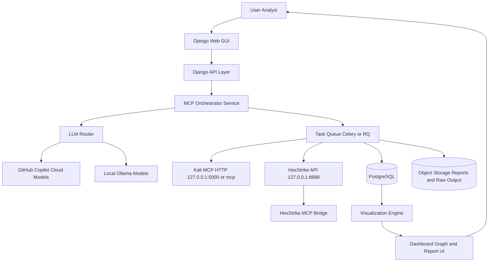
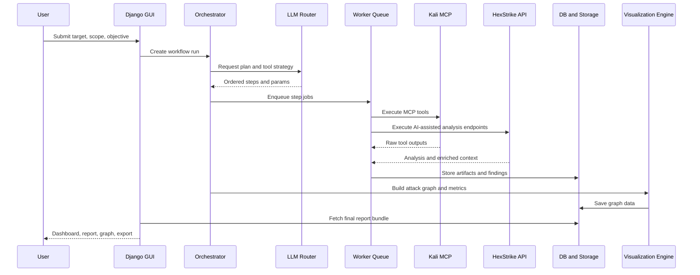

# GUI MCP Django untuk Kali MCP dan HexStrike-AI

## TL;DR
- Gunakan arsitektur 3 lapis: Django GUI (control UI), MCP Gateway (orchestrator), dan Execution Plane (Kali MCP + HexStrike server).
- Terapkan strategi LLM hybrid paralel:
  - LLM Cloud via akun GitHub Copilot (model gratis/tersedia di VS Code) untuk reasoning, planning, dan narasi report.
  - LLM Lokal via Ollama untuk fallback, privasi tinggi, atau saat koneksi cloud tidak stabil.
- Semua eksekusi tool tetap lewat MCP server lokal agar deterministik, terukur, dan mudah diaudit.
- Output akhir disajikan sebagai report terstruktur (JSON/Markdown/PDF) dan graph visualisasi attack chain, asset map, severity trend, serta timeline eksekusi.

## Konteks Repository Saat Ini
Implementasi yang sudah ada menunjukkan pola yang cocok untuk basis GUI:
- Kali MCP server lokal HTTP: [kali_mcp_server.py](kali_mcp_server.py)
- Integrasi VS Code ke Kali MCP: [.vscode/mcp.json](.vscode/mcp.json)
- HexStrike API server: [hexstrike-ai/hexstrike_server.py](hexstrike-ai/hexstrike_server.py)
- HexStrike MCP client-bridge: [hexstrike-ai/hexstrike_mcp.py](hexstrike-ai/hexstrike_mcp.py)
- Orchestrator hybrid awal: [Scripts/hybrid_orchestrator.py](Scripts/hybrid_orchestrator.py)
- Contoh generator report: [Scripts/comprehensive_pentest_report.py](Scripts/comprehensive_pentest_report.py)

Kesimpulan teknis: fondasi control-plane (HexStrike) dan execution-plane (Kali MCP) sudah ada, sehingga Django dapat fokus sebagai orchestration UI, tenancy, workflow management, dan reporting portal.

## Tujuan Sistem
- Menyediakan GUI web terpusat untuk operasi pentest berbasis MCP.
- Menggabungkan reasoning AI (cloud/lokal) dengan eksekusi tool Kali yang stabil.
- Menghasilkan proses yang repeatable dari input target sampai report akhir.
- Menyediakan visibilitas real-time dan audit trail untuk tim keamanan.

## Prinsip Arsitektur
- Pisahkan reasoning dan execution:
  - Reasoning: LLM memilih strategi, prioritas, dan narasi.
  - Execution: tool dijalankan lewat MCP server yang terkontrol.
- Semua task berjalan asynchronous (queue-based), bukan blocking HTTP request.
- Simpan artefak hasil scan sebagai data terstruktur terlebih dahulu, render report belakangan.
- Sediakan fallback otomatis antar penyedia LLM.
- Terapkan policy guardrail untuk penggunaan tool berisiko tinggi.

## Arsitektur Target (High-Level)

## Bagaimana Tool Berjalan Secara Nyata

Jawaban singkat atas pertanyaan Anda: ya, saat ini tool dipanggil secara lokal pada environment tempat MCP server berjalan.

Pada implementasi [kali_mcp_server.py](kali_mcp_server.py), setiap tool dieksekusi melalui subprocess tanpa shell=True. Artinya:
- Binary seperti nmap, sqlmap, ffuf, hydra, dan lain-lain harus tersedia pada host atau container yang menjalankan Kali MCP.
- Jika binary tidak ada, eksekusi akan gagal dengan error Tool not found.

Implikasi production:
- Jika deploy langsung di VM tanpa container, VM harus dipasang semua dependency tool.
- Ini cenderung sulit dijaga konsistensinya antar environment.

## Rekomendasi Deployment: Containerized Execution Plane

Pendekatan terbaik bukan satu container super besar untuk semua hal, tetapi pemisahan per peran:
- Container control plane:
  - django-web
  - orchestrator-worker
  - postgres
  - redis
- Container execution plane:
  - kali-mcp (berisi tool Kali yang diperlukan)
  - hexstrike-api
  - ollama (opsional)

Keuntungan:
- Dependency tools menjadi immutable dan reproducible.
- Build sekali, deploy berkali-kali dengan hasil konsisten.
- Isolasi keamanan lebih baik untuk proses tool berisiko.

## Opsi Arsitektur Container (Disarankan)

### Opsi A: Single Kali MCP Toolpack Container
- Satu image kali-mcp-toolpack berisi curated toolset yang dipakai workflow utama.
- Cocok untuk tahap awal, implementasi cepat.

### Opsi B: Split Toolpack by Domain (Lebih Stabil)
- kali-mcp-recon
- kali-mcp-web
- kali-mcp-ad
- masing-masing expose endpoint MCP terpisah.

Kelebihan Opsi B:
- Image lebih kecil.
- Blast radius jika satu service rusak lebih kecil.
- Scale horizontal per beban kerja (misal web scan lebih berat dari recon).

## Pola Build dan Startup yang Tepat

Pola yang Anda usulkan valid: build dahulu, lalu compose up.

Alur direkomendasikan:
1. docker compose build untuk semua service execution plane.
2. Build stage meng-install seluruh tools dari apt/pip/go atau source release.
3. Jalankan smoke test saat image build untuk verifikasi binary penting.
4. docker compose up -d untuk menjalankan stack.
5. Django health-check memastikan semua MCP endpoint siap sebelum menerima job.

Catatan penting:
- Hindari download tool saat container start (runtime) karena membuat startup lambat dan tidak deterministik.
- Download dan install sebaiknya hanya saat build image.

## Alternatif yang Lebih Baik dari Downloader Container Terpisah

Ide satu container khusus mengunduh tools saat compose up bisa jalan, tetapi kurang ideal untuk production.

Alternatif yang lebih kuat:
- Multi-stage Dockerfile per service toolpack.
- Build pipeline CI menghasilkan image versioned:
  - kali-mcp-toolpack:2026.05.08
- Registry internal menyimpan image teruji.
- Production hanya pull image final, bukan compile/install ulang.

Manfaat:
- Deploy lebih cepat.
- Jejak supply-chain lebih jelas.
- Rollback mudah ke image versi sebelumnya.

## Contoh Struktur Docker Compose Konseptual

    services:
      django-web:
        build: ./gui
        depends_on:
          - postgres
          - redis
          - kali-mcp
          - hexstrike-api

      orchestrator-worker:
        build: ./gui
        command: celery -A core worker -l info
        depends_on:
          - redis
          - kali-mcp
          - hexstrike-api

      kali-mcp:
        build: ./containers/kali-mcp
        ports:
          - "5000:5000"

      hexstrike-api:
        build: ./hexstrike-ai
        ports:
          - "8888:8888"

      ollama:
        image: ollama/ollama:latest
        ports:
          - "11434:11434"

      redis:
        image: redis:7-alpine

      postgres:
        image: postgres:16

## Standar Stabilitas Production

- Pin versi semua tools (jangan latest tanpa kontrol).
- Tambahkan health endpoint untuk tiap service MCP.
- Terapkan resource limit:
  - CPU dan memory per container.
- Gunakan queue priority:
  - recon cepat vs scan berat.
- Terapkan timeout dan circuit breaker di orchestrator.
- Simpan metadata eksekusi:
  - nama tool,
  - versi binary,
  - hash output.

## Standar Keamanan Supply Chain

- Gunakan base image minimal dan terverifikasi.
- Verifikasi checksum/signature release tools.
- Generate SBOM per image.
- Scan image berkala untuk CVE.
- Gunakan non-root user bila memungkinkan.
- Segmentasi network antar container (internal network).

## Keputusan Praktis untuk Proyek Ini

Untuk repositori Anda, jalur paling realistis:
1. Mulai dari Opsi A (single kali-mcp-toolpack) agar cepat jalan.
2. Setelah workflow stabil, pecah ke Opsi B per domain tools.
3. Implement CI build image terjadwal mingguan untuk patch keamanan.
4. Django hanya menjalankan orchestration, tidak pernah install tools saat runtime.

Dengan pendekatan ini, kekhawatiran Anda tentang ketidakstabilan instalasi host production dapat teratasi secara sistematis.

## Strategi LLM Hybrid Paralel

### Tujuan
- Memaksimalkan kualitas reasoning tanpa bergantung pada satu provider.
- Menjaga continuity saat cloud model gagal, rate-limited, atau offline.

### Pola Routing
1. Primary mode:
- Planning dan reasoning kompleks ke GitHub Copilot cloud model.
- Eksekusi command/tool tetap lokal via MCP.

2. Secondary mode:
- Jika cloud gagal atau policy mewajibkan lokal, route ke Ollama.

3. Parallel evaluate mode (opsional):
- Prompt yang sama dikirim ke cloud + lokal.
- LLM Judge ringan memilih output terbaik berdasar rubric:
  - kelengkapan langkah,
  - keamanan operasional,
  - kecocokan terhadap objective.

### Decision Matrix Sederhana
- Cloud model dipilih untuk:
  - perencanaan multi-step,
  - ringkasan eksekutif,
  - rekomendasi remediation.
- Ollama dipilih untuk:
  - data sensitif internal,
  - operasi offline,
  - biaya harus nol atau sangat minim.

## Modul Django yang Disarankan
- app_auth:
  - login, RBAC, API key management.
- app_targets:
  - domain/IP/scope management.
- app_workflows:
  - template workflow (Recon, Web Audit, AD Audit, Full Pentest).
- app_runs:
  - run execution, status, retry, cancel.
- app_mcp:
  - koneksi ke Kali MCP dan HexStrike endpoint, tool registry, health check.
- app_llm:
  - provider abstraction (Copilot-backed endpoint adapter, Ollama adapter).
- app_findings:
  - normalisasi finding, deduplikasi, scoring severity.
- app_reports:
  - markdown/json/pdf exporter.
- app_visualization:
  - graph generation (attack chain, dependency, timeline).
- app_audit:
  - immutable logs untuk compliance.

## Data Model Inti
- Workspace
- Target
- ScopeRule
- WorkflowTemplate
- WorkflowRun
- StepRun
- ToolExecution
- RawArtifact
- Finding
- RiskScoreSnapshot
- ReportBundle
- LlmTrace
- AuditEvent

Relasi utama:
- Satu WorkflowRun punya banyak StepRun.
- Satu StepRun punya banyak ToolExecution.
- ToolExecution menghasilkan RawArtifact.
- RawArtifact diproses jadi Finding.
- Finding dikompilasi menjadi ReportBundle.

## Alur Kerja End-to-End

### Alur 1: Guided Assessment
1. User login ke GUI dan pilih target + scope.
2. User pilih template workflow (misal Comprehensive Web Security).
3. Django kirim objective ke LLM Router untuk membuat rencana langkah.
4. Orchestrator mendaftarkan task ke queue.
5. Worker memanggil tool MCP sesuai step:
- nmap, whatweb, gobuster, nikto, sqlmap, dan lain-lain.
6. Semua output mentah disimpan sebagai artefak.
7. Parser menormalkan output menjadi finding terstruktur.
8. Risk engine menghitung severity dan confidence.
9. Report engine membentuk:
- executive summary,
- technical findings,
- remediation roadmap.
10. Visualization engine membuat graph dan dashboard.
11. User unduh report atau share link internal.

### Alur 2: Hybrid AI Auto-Orchestrated
1. User memilih mode Auto.
2. LLM cloud membuat plan awal.
3. LLM lokal melakukan cross-check cepat untuk sanity.
4. Orchestrator mengeksekusi langkah prioritas tinggi dulu.
5. Jika ada error tool, recovery policy dipanggil:
- retry,
- parameter adjust,
- fallback tool setara.
6. Run selesai dengan skor coverage dan residual risk.

### Alur 3: Offline-First
1. User memilih mode Local Only.
2. Seluruh reasoning pakai Ollama.
3. Tool execution tetap via Kali MCP lokal.
4. Report dihasilkan tanpa ketergantungan internet.

## Sequence Penggunaan User sampai Report

## Integrasi VS Code Copilot dan Akun GitHub

### Realita Teknis
- VS Code Copilot terhubung ke akun GitHub untuk akses model cloud yang disediakan layanan Copilot.
- Untuk GUI Django, sebaiknya jangan mengandalkan plugin VS Code langsung sebagai backend layanan aplikasi.
- Implementasi yang disarankan:
  - LLM Router menyediakan adapter cloud provider yang legal dan stabil untuk backend service.
  - Di sisi developer workflow, VS Code tetap bisa dipakai untuk operasi manual MCP/testing.

### Kenapa dipisah
- Copilot di editor adalah developer tool.
- Django GUI adalah production-like multi-user app.
- Pemisahan ini menghindari coupling terhadap editor session dan memudahkan observability.

## Integrasi Ollama Lokal
- Jalankan Ollama daemon di host yang sama atau node inference terpisah.
- Registrasikan model lokal per use-case:
  - planning ringan,
  - summarization,
  - classification findings.
- Terapkan timeout + token budget ketat agar antrian job tetap sehat.

Contoh konfigurasi konseptual:
- Provider order: cloud-first -> ollama-fallback.
- Privacy mode: force ollama untuk target internal.

## Pipeline Reporting dan Visualisasi

### Report
- Format output:
  - JSON canonical untuk mesin,
  - Markdown untuk analyst,
  - PDF untuk manajemen.
- Isi minimum:
  - scope,
  - metodologi,
  - attack path,
  - evidence,
  - severity matrix,
  - remediation dengan prioritas.

### Graph Visualisasi
- Attack Chain Graph:
  - node: target, service, vulnerability, credential, privilege level.
  - edge: discovered_by, exploited_by, escalated_to.
- Asset Exposure Map:
  - domain/subdomain, port, teknologi, status risiko.
- Timeline:
  - urutan step, durasi, retry, success/failure.

## Security dan Governance
- Wajib RBAC dan approval gate untuk tool berisiko tinggi.
- Simpan command, parameter, dan output hash untuk audit.
- Terapkan allowlist target/scope agar tidak keluar otorisasi.
- Enkripsi data sensitif at-rest.
- Pisahkan environment lab, staging, dan production.

## Rencana Implementasi Bertahap

### Fase 1: Foundation
- Buat Django project + app_runs + app_mcp + app_targets.
- Integrasi health check ke endpoint:
  - Kali MCP 5000/mcp,
  - HexStrike 8888/health.
- Jalankan workflow minimal:
  - nmap_scan,
  - whatweb_scan,
  - nikto_scan.

### Fase 2: LLM Router
- Tambah app_llm dengan adapter cloud dan ollama.
- Implement fallback policy + retry policy.
- Simpan trace prompt/response terstruktur.

### Fase 3: Reporting
- Normalisasi finding + severity scoring.
- Buat generator markdown dan json.
- Tambah graph pertama (attack chain).

### Fase 4: Enterprise Hardening
- RBAC detail, audit log immutable, dan approval workflow.
- Rate limiting, quota, dan job prioritization.
- Multi-tenant workspace jika dibutuhkan.

## Risiko dan Mitigasi
- Risiko: over-automation menghasilkan false positive.
  - Mitigasi: confidence scoring + human validation step.
- Risiko: ketergantungan cloud LLM.
  - Mitigasi: ollama fallback + offline mode.
- Risiko: command berbahaya keluar scope.
  - Mitigasi: policy engine, denylist, approval gate.

## Ringkasan Keputusan Arsitektur
- Gunakan Django sebagai orchestration GUI, bukan executor langsung.
- Pertahankan Kali MCP sebagai execution plane tunggal untuk tooling.
- Gunakan HexStrike untuk AI-enriched control-plane.
- Terapkan LLM hybrid paralel cloud + local untuk reliability dan privasi.
- Akhiri setiap run dengan bundle report + graph agar output langsung bernilai untuk user dan manajemen.
